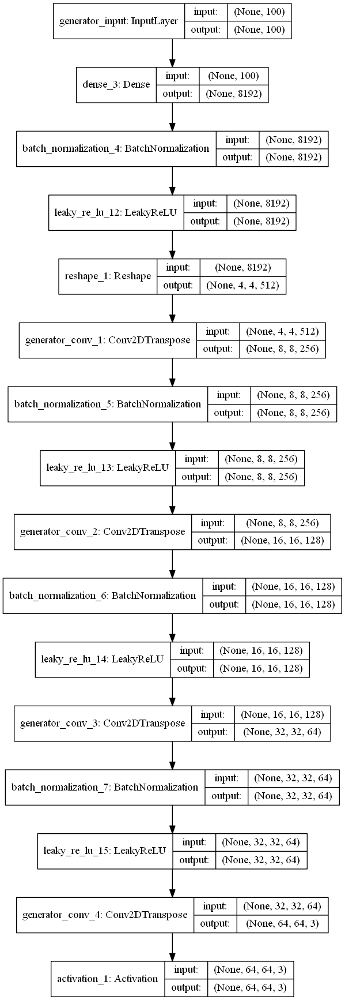

# Improved Training WGANs

- This is a Keras implementation for DCGANs model using 3 different methods
    1. Vanilla GAN loss
    2. Wasserstein GAN
    3. Wasserstein GAN - Gradient Penalizing
- To show difference between the above mentioned training loss functions, in terms of stability and speed of convergence
- Motivated by [Improved Training of Wasserstein GANs paper](https://arxiv.org/pdf/1704.00028.pdf)

---

## Use the repository

- To install the repo requirements `pip install -r requirements.txt`

- `config.yaml` file decides which method you can use 
    1. Vanilla GAN
    2. Wasserstein GAN (Weight Clipping)
    3. Wasserstein GAN (Gradient Penalizing),
    
    and what kind of optimizer
    1. Adam with Decay 
    2. Adam
    3. RMSProp

- To run the code `python3 code/main.py`
    - What to expect?
        - You have the dataset downloaded (don't worry everything is mentioned in the next section)
        - A folder with the name of the method in the `config.yaml` file will be created as follows `f'{method_name}_running_dir'` which will contain your
            1. TensorBoard logs
            2. Sampled images
            3. Model and its weights
            4. Model summaries and visualization

---

## Data

- For Vanilla-GANs & Wasserstein-GANs (Weight clipping) I used "MNIST" dataset with shapes of 28 x 28 x 1
- Wasserstein GAN (Gradient Penalizing) I used "Celeb_A" dataset  
    - The dataset mentioned in the paper (LSUN Bedrooms' Training dataset) was 42.77GB and using Colab it was a little bit messy using that to download and unzip every-time the runtime was disconnected.
    - How to download? 
        - Access their folder on [GDrive](https://drive.google.com/drive/folders/0B7EVK8r0v71pTUZsaXdaSnZBZzg), then download the folder called `img_align_celeba.zip`
        - Unzip the zip file to `./data/train/`
    - Dataset images had target shapes of 64 x 64     
 
 ---
 
 ## Model Architecture
 
 - I implemented DCGANs as per the paper, with some amends
 
The WGAN-GP Model:

   

Its Discriminator:

   

Its Generator:

   
   
--- 

## Results

- To be added soon

---

## Conclusion

- To be added soon

---
